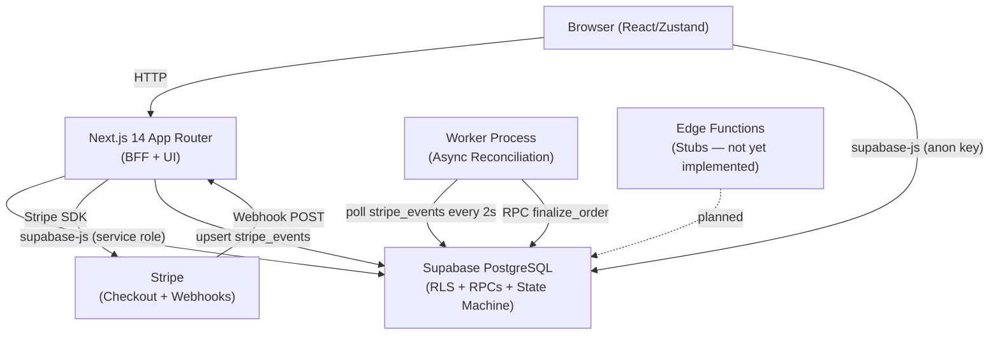
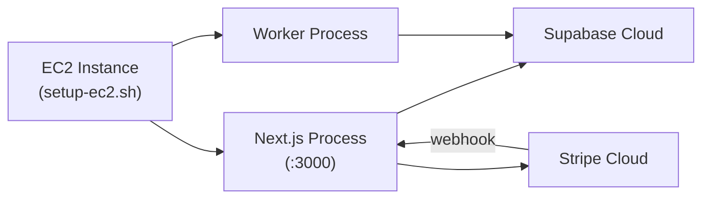

# Architecture

## System Overview

iRepair v2.5 is a five-layer system:

## Key Design Decisions

### Webhook Enqueue-Only
The Next.js webhook handler (`POST /api/webhook/stripe`) only verifies the Stripe signature and upserts the event into `stripe_events`. It does not process the event. All processing is delegated to the worker.

### Worker Polling
The worker polls `stripe_events` where `processed = false` every 2 seconds. No message queue is used. This is intentionally simple and restartable — the queue survives worker crashes.

### DB-Level State Machine (Migration 009)
Order status transitions are enforced at the database level via the `transition_order_state` RPC. Direct `UPDATE` on `orders` is revoked from `anon` and `authenticated` roles. The worker uses the service role key, which bypasses this restriction.

### Advisory Locks
`pg_advisory_lock` / `pg_advisory_unlock` are available in `src/lib/locks/advisoryLock.ts` but are **not currently called** from the checkout route. The `finalize_order` RPC uses `SELECT ... FOR UPDATE` row-level locking instead.

### Semantic Projection Layer
`src/lib/semantic/mapToUI.ts` is the single place where DB state is translated to UI display state (`ui_state`, `ui_intent`, `severity`). UI components consume these derived fields rather than raw DB values.

### RLS
Row-level security is enabled on all main tables. Public users can read active catalog items. Users can only read their own orders. Admins (role = 'admin' in `profiles`) can read and update inventory.

## Deployment Topology

The `setup-ec2.sh` script at the repo root handles EC2 provisioning.
