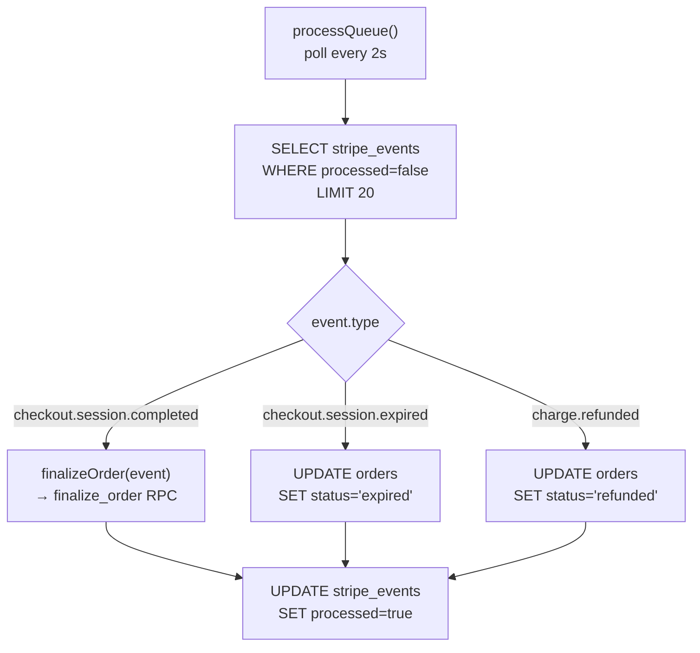

# Components

## Next.js App (`src/`)

### Pages

| Route | File | Description |
|---|---|---|
| `/` | `src/app/page.tsx` | Home / landing page |
| `/shop/catalog` | `src/app/shop/catalog/page.tsx` | Product catalog — lists parts and services, uses `mapInventoryPart` for semantic state |
| `/checkout` | `src/app/checkout/page.tsx` | Checkout page — fetches live prices, collects email, calls `/api/checkout` |
| `/auth` | `src/app/auth/page.tsx` | Sign in / sign up — Supabase Auth, creates profile row on first login |
| `/dashboard` | `src/app/dashboard/page.tsx` | User order history — reads `orders` filtered by `user_id` |
| `/admin` | `src/app/admin/page.tsx` | Admin panel — inventory and service management, role-gated (`profiles.role = 'admin'`) |
| `/success` | `src/app/success/page.tsx` | Post-payment success page |
| `/error` | `src/app/error/page.tsx` | Error / cancellation page |

### API Routes

| Route | File | Description |
|---|---|---|
| `POST /api/checkout` | `src/app/api/checkout/route.ts` | Creates draft order, validates stock/MOQ, creates Stripe Checkout session |
| `POST /api/webhook/stripe` | `src/app/api/webhook/stripe/route.ts` | Verifies Stripe signature, upserts event to `stripe_events` |
| `/api/inventory/reserve` | `src/app/api/inventory/reserve/` | **Empty stub** — not implemented |
| `/api/inventory/release` | `src/app/api/inventory/release/` | **Empty stub** — not implemented |

### React Components

| Component | File | Description |
|---|---|---|
| `Header` | `src/components/Header.tsx` | Site header with navigation and cart icon |
| `CartDrawer` | `src/components/CartDrawer.tsx` | Slide-out cart panel |

Additional component subdirectories exist but are empty: `src/components/layout/`, `src/components/catalog/`, `src/components/ui/`, `src/components/cart/`.

### Libraries (`src/lib/`)

| Module | Path | Description |
|---|---|---|
| Supabase client | `src/lib/supabase/client.ts` | Browser-side Supabase client (anon key) |
| Supabase server | `src/lib/supabase/server.ts` | Server-side Supabase client (service role key) |
| Stripe client | `src/lib/stripe/client.ts` | Stripe SDK instance |
| Stripe webhook | `src/lib/stripe/webhook.ts` | `constructStripeEvent` helper |
| Advisory locks | `src/lib/locks/advisoryLock.ts` | `acquireAdvisoryLock` / `releaseAdvisoryLock` via Supabase RPC |
| Schema | `src/lib/schema.ts` | `CartItem` interface (`id`, `type`, `quantity`) |
| Semantic types | `src/lib/semantic/types.ts` | `UIState`, `UIIntent`, `Severity` type definitions |
| Semantic mapper | `src/lib/semantic/mapToUI.ts` | `mapInventoryPart`, `mapOrder`, `mapRepairService` |

Empty stubs: `src/lib/db/`, `src/lib/cache/`.

### State (`src/store/`)

| Store | File | Description |
|---|---|---|
| `useCart` | `src/store/cart.ts` | Zustand cart store — in-memory only, not persisted |

---

## Worker (`worker/src/`)

| Module | File | Description |
|---|---|---|
| Entry point | `worker/src/index.ts` | Starts `setInterval` calling `processQueue` every 2 seconds |
| Queue poller | `worker/src/queue/pollQueue.ts` | Fetches up to 20 unprocessed `stripe_events`, dispatches by type |
| Finalize order | `worker/src/jobs/finalizeOrder.ts` | Idempotency check + calls `finalize_order` RPC |
| DB client | `worker/src/db/client.ts` | Supabase client (service role) for the worker |

The `worker/src/locks/` directory exists but is empty.

### Worker Event Handling

---

## Supabase Edge Functions (`supabase/functions/`)

All four edge function directories are **empty stubs**:

- `stripe-webhook-ingest/` — planned alternative webhook ingest path
- `order-events/` — planned order event streaming
- `inventory-realtime/` — planned real-time inventory updates
- `health-check/` — planned health endpoint
