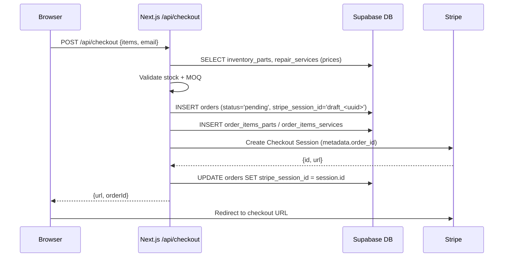
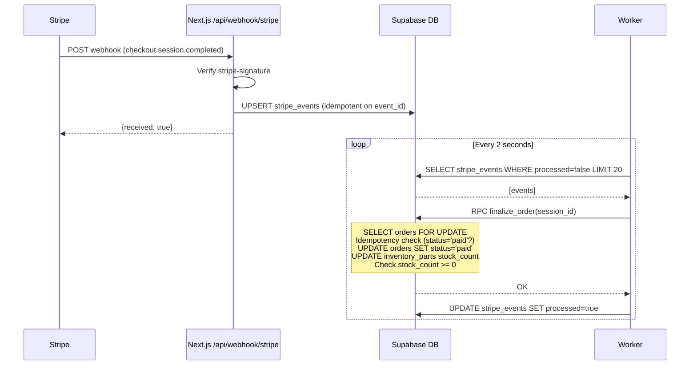
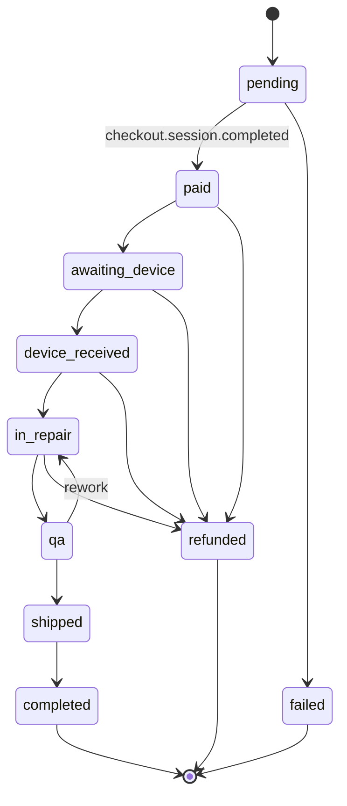
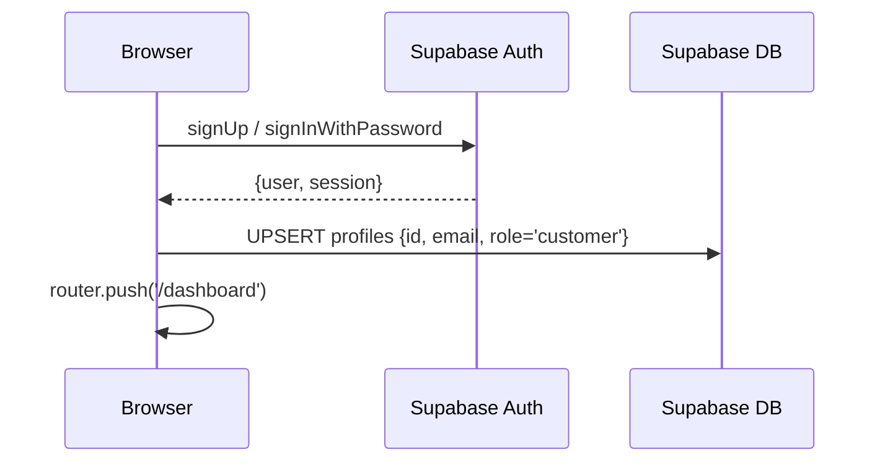
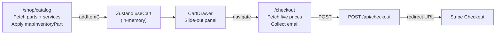

# Workflows

## 1. Checkout Flow

**Error path**: If any step after order creation fails, `cleanupCheckoutDraft` deletes the order items and order, and expires the Stripe session.

---

## 2. Stripe Webhook → Order Finalization

---

## 3. Order State Machine

Transitions are enforced by the `transition_order_state(p_order_id, p_next_state)` RPC. Direct `UPDATE` on `orders` is revoked from `anon` and `authenticated` roles (migration 009). The worker uses the service role key.

---

## 4. Authentication Flow

Admin access is granted by manually setting `profiles.role = 'admin'` in the database.

---

## 5. Catalog → Cart → Checkout

---

## 6. Worker Failure Recovery

If the worker crashes mid-processing:
- `stripe_events` rows remain with `processed = false`
- On restart, the worker re-fetches and reprocesses them
- `finalize_order` RPC has an idempotency guard (checks `status = 'paid'` before acting)
- Stripe may retry webhooks; the `upsert` with `ignoreDuplicates: true` prevents duplicate rows
